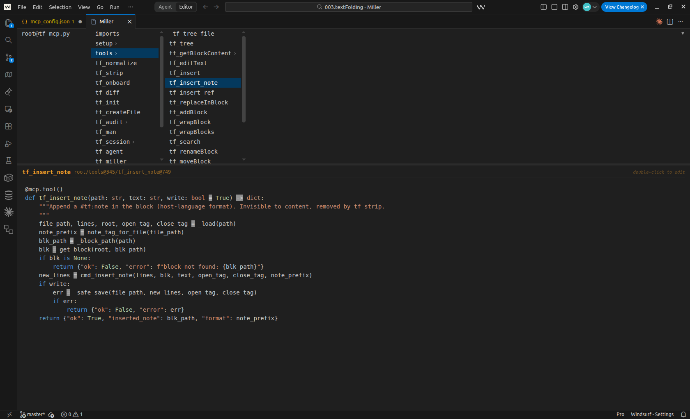
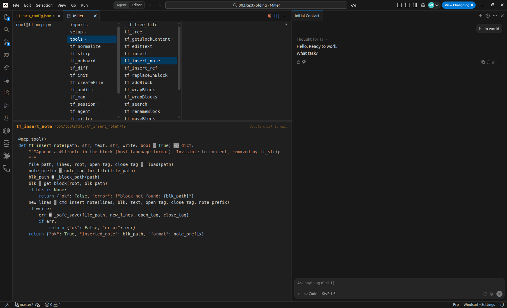
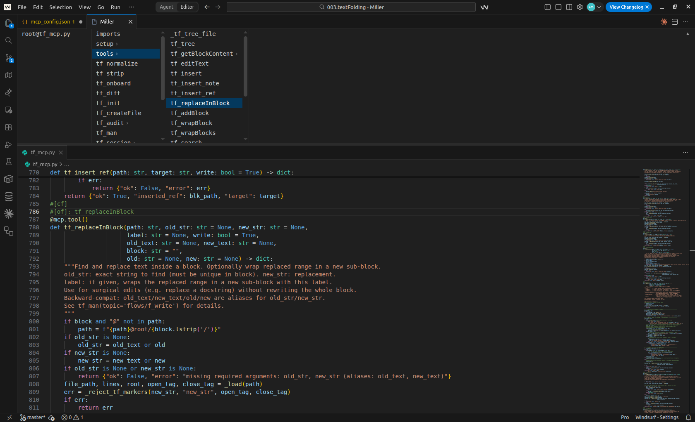
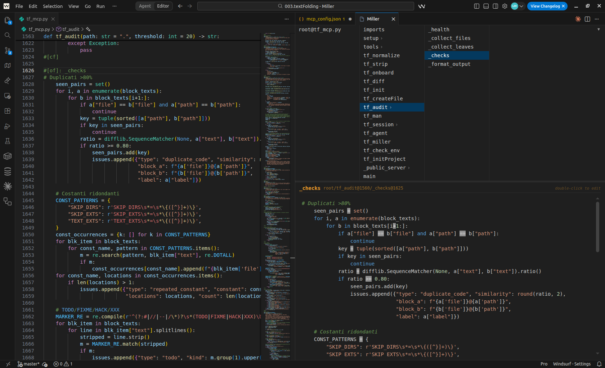

# TextFolding

[](https://github.com/lucmas655321/tf/actions/workflows/tests.yml)

**A protocol proposal for structured AI navigation of source files — with a proof-of-concept implementation.**

---

## Origin

This project started as an attempt to bring [**Code Browser**](https://tibleiz.net/code-browser/) by Marc Kerbiquet inside VSCode as an extension. Code Browser is a magnificent standalone editor built around marker-based hierarchical folding — we consider it the reference implementation of this idea and are grateful to its author. (It was [discussed on HN in 2014](https://news.ycombinator.com/item?id=8409084).)

While building the VSCode port (Miller), we noticed that the same `#[of]:`/`#[cf]` markers that help humans navigate large files could give AI agents a structured entry point — letting them read one block instead of the entire file.

That observation became this project.

---

## The Idea

Without TF, an AI agent navigates a large file by trial and error: it calls `Read` on a range, doesn't find what it needs, tries another range, backtracks. Each probe burns tokens and adds latency. The agent has no map — it's sampling blindly.

Worse: when the agent finds something that *looks* like the right block, it may edit it without verifying it's the canonical implementation. Duplicates, near-duplicates, similar function names across files — the agent picks one and edits it. Later turns build on that edit. Implementations diverge silently.

TF gives the agent a map. The text *is* the map — no external index, no build step, no separate tooling. Files embed a lightweight navigable tree using plain comment markers:

```python
#[of]: root
#[of]: server
#[of]: dispatch
def dispatch(request):
    route = match(request.path)
    return route.handler(request)
#[cf]
#[of]: middleware
def auth_middleware(request, next):
    if not request.token:
        return Response(401)
    return next(request)
#[cf]
#[cf]
#[of]: models
class User:
    name: str
    email: str
#[cf]
#[cf]
```

The AI navigates the tree, then reads only what it needs:

```
tf_tree("app.py")                          →  structure (~120 tokens)
tf_getBlockContent("app.py@root/dispatch") →  target block (~80 tokens)
tf_editText("app.py@root/dispatch", fix)   →  done
```

Markers follow each language's comment syntax (`#` Python, `//` JS/TS, `<!--` HTML/MD, etc.) — invisible to compilers and linters, no tooling changes required. Custom markers supported for any format. `tf_strip` removes them all and leaves the original file unchanged.

---

## Measured Results

Benchmarks: Claude Sonnet 4.6, temperature=0, 3 runs per condition. Files: real Python stdlib modules. Tasks: short, well-defined edits — the easiest possible scenario for a standard agent.

| File | Size | A cache_create | TF cache_create | Cost savings |
|------|------|----------------|-----------------|--------------|
| textwrap_s | ~500 lines | 12.3k | 7.2k | **-16%** |
| argparse_m | ~2,600 lines | 16.5k | 9.9k | **-24%** |
| pydecimal_l | ~6,400 lines | 14.7k | 7.3k | **-50%** |

The savings grow with file size — exactly where they matter most. These benchmarks measure short, isolated sessions: the gap widens in real use.

In a long session, every token accumulated in context eventually forces a **compaction** — the assistant summarizes and discards older messages to stay within limits. This is invisible but lossy: architectural decisions, debugging context, earlier code discussed — all compressed or dropped. TF sessions accumulate fewer tokens per turn, delay compaction, and preserve conversation fidelity longer.

Correctness was identical across all runs. In a separate multi-file test (6 tasks, two similar files open), standard mode edited the wrong file 33% of the time. TF: 0%.

> **These are early numbers from a proof of concept.** Each data point is 3 runs of 15-prompt sessions — not a large sample, but not a trivial one either. We publish them as a directional signal; independent replication is welcome.
>
> The benchmark uses a conservative setup: TF runs as a plain MCP server with no system prompt, no platform-specific tuning, and no special agent skills — by design, to keep results portable across AI assistants. The downside is that agents occasionally fall back to native tools or misuse TF in early turns before the protocol is clear. With TF integrated as a first-class system tool, we expect the adoption curve to disappear and the savings to grow — but that is a hypothesis, not a measurement.

---

## What This Repo Contains

- **`tf_backend.py`** — pure Python parser and block manipulation library (no external dependencies)
- **`tf_mcp.py`** — MCP server exposing navigation and edit tools to AI agents
- **`vscode-textfolding/`** — VSCode extension with Miller, the column-based block navigator (Code Browser inside VSCode)

### MCP server modes

| Command | For | Tools |
|---------|-----|-------|
| `tf-mcp` | AI agents (daily use) | Single `tf(cmd)` dispatcher + `tf_man()` |
| `tf-mcp-dev` | Development / debugging | All 29 individual tools |

`tf-mcp` is the recommended default. The single-tool interface reduces noise in the agent's tool list and forces it to use the TF protocol rather than falling back to generic file tools.

---

## Miller

Miller is the VSCode port of Code Browser's column navigation — useful independently of any AI integration. If you've used Code Browser and missed it in your IDE, this is it. Miller is largely (though not fully) compatible with Code Browser's marker format, so existing annotated files work without conversion.

**Install (2 steps):**

1. Download [`vscode-textfolding-0.1.0.vsix`](vscode-textfolding-0.1.0.vsix)
2. In VSCode: `Extensions` → `...` → `Install from VSIX…` → select the file

Or from the terminal:
```bash
code --install-extension vscode-textfolding-0.1.0.vsix
```

Open with `Ctrl+Alt+M` (Mac: `Cmd+Alt+M`).

Miller is also a standalone code browser — no AI required. When the source file is open alongside Miller, clicking a block in Miller scrolls the editor to the exact corresponding line. This gives you a two-panel navigation experience: the column view for structure, the editor for context and editing. Think of it as a persistent, clickable outline that controls your cursor.

### Screenshots


*Base panel: column-based block structure of a file*


*Cascade view: nested blocks expanded inline*


*Navigation: clicking a block scrolls the editor to the exact line*


*Side-by-side: editor and Miller panel open together*

---

The AI and Miller share the same file view:
- When the AI edits a block, Miller reflects it immediately
- In **Propose Mode**, the AI sends a diff and waits — Miller shows `+`/`−` lines, you click ✓ Apply or ✗ Discard before anything is written
- The AI signals which block it's examining; you can signal your focus back by clicking

---

## Quick Start

```bash
pip install git+https://github.com/lucmas655321/tf
# verify:
python -c "from tf_backend import parse; print('ok')"
```

Add to `.mcp.json` in your project root:

```json
{
  "mcpServers": {
    "textfolding": {
      "command": "tf-mcp",
      "cwd": "/path/to/your/project"
    }
  }
}
```

Then tell your AI: *"Call tf('') to read the TF manual, then help me with..."*

### Key tools

| Tool | What it does |
|------|-------------|
| `tf_tree(path)` | Show the block structure of a file |
| `tf_getBlockContent(path)` | Read a specific block |
| `tf_editText(path, text)` | Edit a block's content |
| `tf_init(path)` | Auto-structure an existing file (AI-assisted, adds markers based on existing code structure — preview before applying) |
| `tf_strip(path)` | Remove all markers, restore the original file |

`tf_init` and `tf_strip` both operate in-place on the file. `tf_init` is non-destructive (markers are comments); `tf_strip` is reversible only from git. **Commit before running either on important files.**

---

## Status

Pre-release (0.1.0). The marker format and core protocol are stable; the tool API may change. Not yet on PyPI — install via `pip install git+https://github.com/lucmas655321/tf`.

This is a proof of concept — functional, tested, used daily on this codebase, but not production-hardened. Built by one person with Claude as a collaborator: the AI wrote significant portions of the code under human direction, which is itself a demonstration of the workflow this tool is designed to support.

---

## Requirements

- Python 3.10+, `mcp>=1.0` (`tf_backend.py` itself has zero dependencies)
- An MCP-compatible AI assistant (Claude Code, Cursor, Windsurf, Claude Desktop, etc.)
- VSCode for Miller (`.vsix` in the repo root — see [Miller](#miller) section)

---

## Contributing

This is a one-person side project. If you find it useful, any help is welcome — bug reports, ideas, benchmarks on your own codebase, or just a star. Open an issue or a PR.

---

## License

MIT
